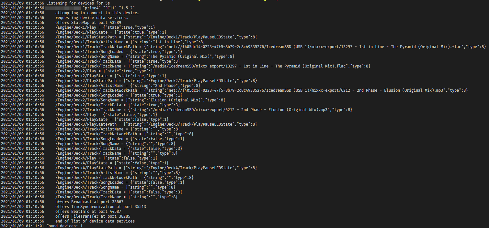

# StagelinQ for Golang

This library implements Denon's StagelinQ protocol, allowing any Go application to talk to devices that are compatible with this protocol on the network.

An example application is provided that, if running successfully, will output information like this:

## Features

- Automatically discover StagelinQ-compatible devices on the network
- Access state map information such as currently playing track metadata, fader values, etc.
- Access live beat stream information such as current beat, total beats, bpm, and timeline position.

## Stability

The code of this project is an **experimental** reverse-engineering effort and therefore can behave erratically in untested cases. Currently, this code only has been practically tested with the Denon Prime 4.

If you have any other Denon devices you would like to test this library against, please do! Even better, you can let me know if you run into any bugs by reporting them [as an issue ticket](https://github.com/icedream/go-stagelinq/issues).

## Demo programs

This repository gives you example programs to play around with to test this
library's functionality:

- `stagelinq-discover`: Simple code to discover devices and dump their states.
- `beatinfo`: Like `stagelinq-discover` except it will dump the beat info stream instead.
- `storage`: A demo for serving a remote library via the EAAS protocol.

## Building

Please make sure you have Go 1.19 or newer.

You may install the binaries in this repository one of two means:

- `git clone` this repository and run `go build -v ./cmd/<binary>` to build the binary.
- Run `go install github.com/icedream/go-stagelinq/cmd/<binary>` to install the binary to your `$GOPATH`.

## Usage

To use this library, import `"github.com/icedream/go-stagelinq"` in your Go project. This will give you access to the `stagelinq` library namespace.

EAAS functionality is served in a subpackage via `"github.com/icedream/go-stagelinq/eaas"`.

Make sure to run `go mod tidy` for Go to pick up the library properly and update `go.mod` and `go.sum` in your project.

[Go code documentation is available](https://pkg.go.dev/github.com/icedream/go-stagelinq).

## Testing

This project uses Go tests, they can be run with this command:

    go test ./...

## License

This code is licensed under the MIT license. For more information, please read [LICENSE](LICENSE).
